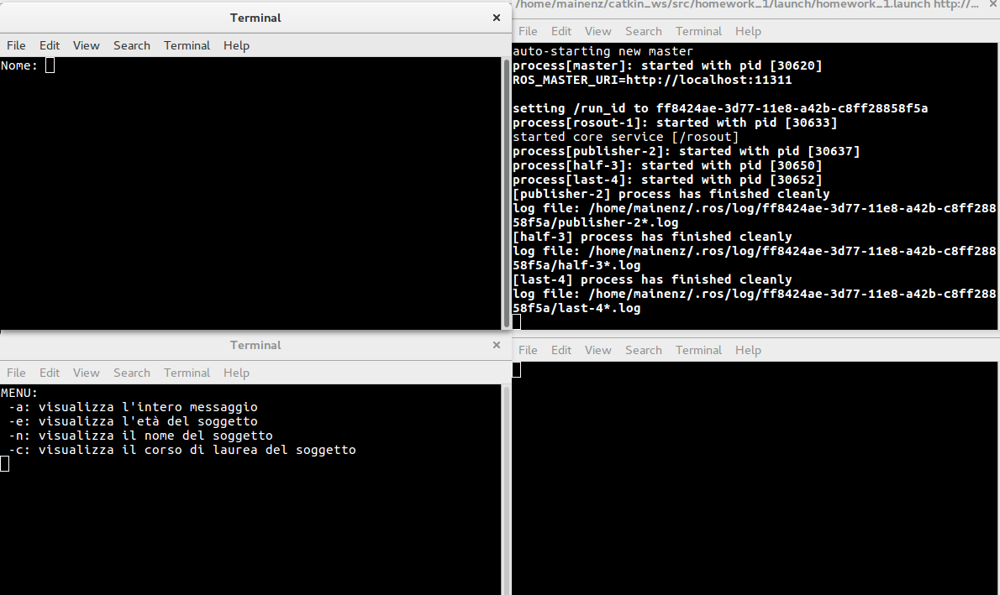
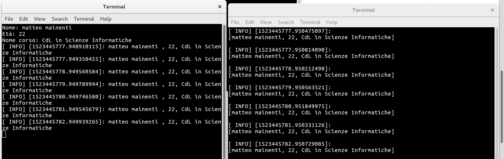
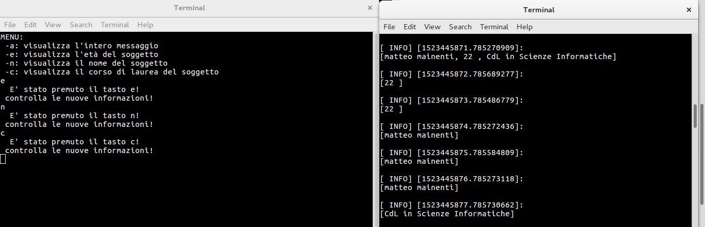
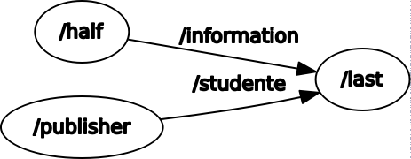

# homework_1

---
## Breve descrizione
Il programma è composto da tre nodi ben distinti con le seguenti caratteristiche:
 - il nodo Publisher permette all'utilizzatore di scrviere le informazioni inerenti a uno studente, quali nome, età e corso di laurea.
 - il nodo Half permette di inserire un comando tra una serie di lettere a scelta, ognuna descritta nel menù all'avvio del programma
 - il nodo finale Last riceve la stringa di publisher e half e visualizza a schermo le stringhe  ricevuta da publisher ritagliata in base al comando ricevuto da half
 ---
## RosLaunch


Il comando per lanciare i tre nodi è il seguente 
```
$roslaunch homework_1 homework_1.launch
```
o in alternativa, volendo usare rosrun
```
$rosrun homework_1 publisher
```
```
$rosrun homework_1 half
```
```
$rosrun homework_1 last
```

nell'immagine di seguito, in ordine di lettura vediamo Publisher, roscore, Half e Last, da cui possiamo vedere il menù iniziale di Half e la richiesta del nome da parte di Publisher.



## Funzionamento

Per eseguire il programma bisogna inserire le proprie credenziali all'interno del publisher, che successivamente inizierà a inviare al nodo Last la stringa per intero.

Inizialmente il nodo Last pubblicherà a schermo tutta la stringa, siccome inizialmente il comando predefinito è 'a'. 




Successivamente Half mostrerà a schermo un'eventuale modifica del comando, che andrà a modificare l'output di Last.



## Grafico 



## Implementazione

Vedere commenti all'interno del codice
